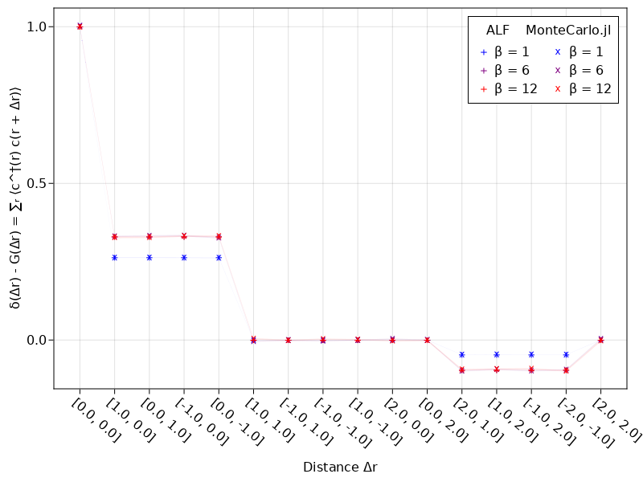
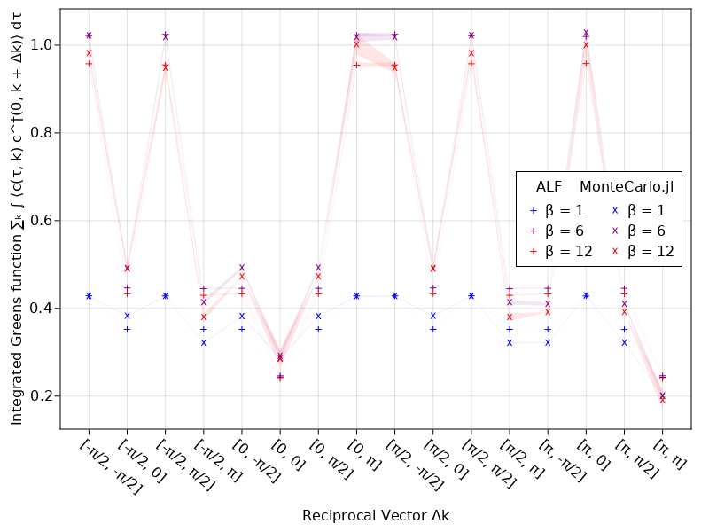
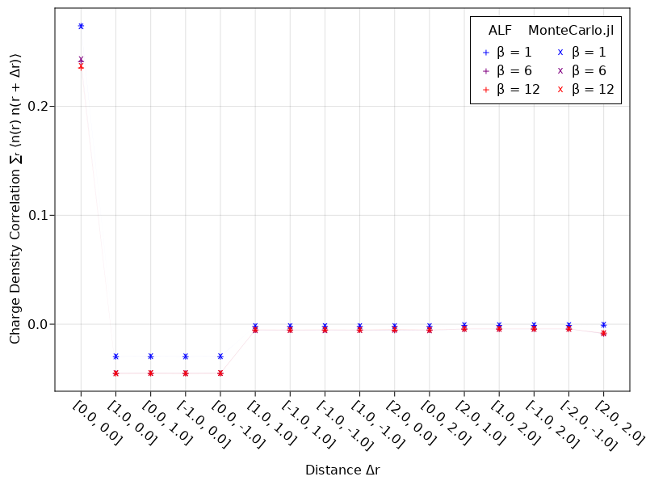
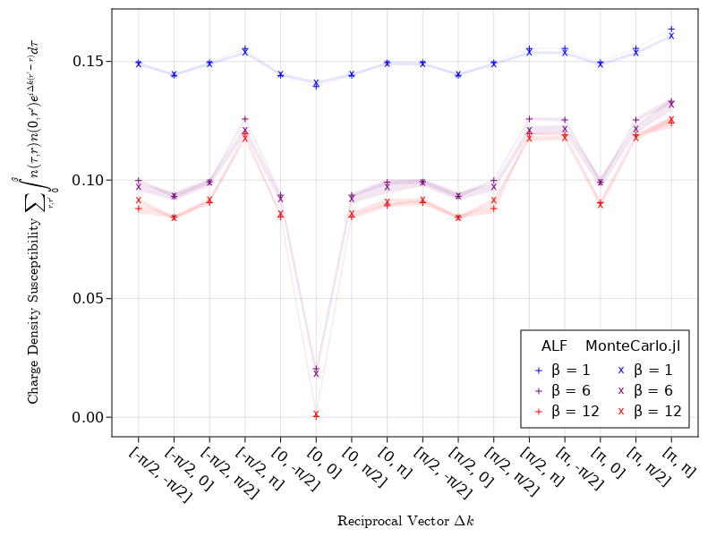
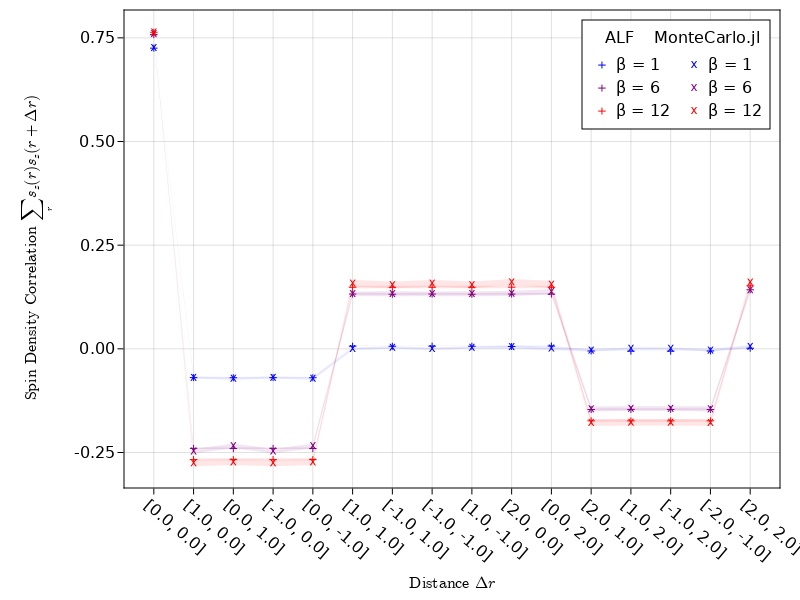
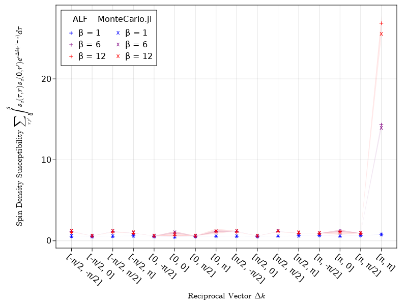

# Crosscheck with ALF

The [ALF project](https://git.physik.uni-wuerzburg.de/ALF) (Algorithms for lattice fermions) is a long running project implementing DQMC in Fortran. They have implemented various different models, lattices, stabilization methods and measurements. A relatively simple comparison for us will be the "plain vanilla Hubbard model" on a square lattice, which is close to but not exactly the same as our repulsive Hubbard model.


## The ALF Simulation


### Installation

The ALF project provides a [python interface](https://git.physik.uni-wuerzburg.de/ALF/pyALF) which we used for simplicity. For installation instructions see the link. At the time of writing pyALF is linked to ALF 2.0. (Specifically commit 82949f66065eff8214c0149c8be2d10d6d0a6822.)

!!! note 

    You can also add a load path for pyALF temporarily in an active python session. Try `import sys` and `sys.path.append('path/to/pyALF-ALF-2.0/')`.

### Usage

With python, pyALF and the necessary packages installed we can now setup and run simulations. In python, we run:

```python
import os
from py_alf import Simulation        # Interface with ALF

sims = []                            # Vector of Simulation instances
for beta in [1.0, 6.0, 12.0]:        # Values of inverse temperature beta
    sim = Simulation(
        'Hubbard',                   # Hamiltonian
        {                            # Model and simulation parameters for each Simulation instance
        'Model': 'Hubbard',          #    Base model
        'Lattice_type': 'Square',    #    Lattice type
        'L1': 4,                     #    Lattice length in the first unit vector direction
        'L2': 4,                     #    Lattice length in the second unit vector direction
        'Checkerboard': False,       #    Whether checkerboard decomposition is used or not
        'Symm': True,                #    Whether symmetrization takes place
        'ham_T': 1.0,                #    Hopping parameter
        'ham_U': 4.0,                #    Hubbard interaction
        'ham_Tperp': 0.0,            #    For bilayer systems
        'beta': beta,                #    Inverse temperature
        'Ltau': 1,                   #    '1' for time-displaced Green functions; '0' otherwise 
        'NSweep': 100,                #    Number of sweeps per bin
        'N_skip': 10,                #    skip 50 bins meaning 50x NSweep
        'NBin': 60,                 #    Number of bins
        'Dtau': 0.1,                 #    Only dtau varies between simulations, Ltrot=beta/Dtau
        'Mz': True,                  #    If true, sets the M_z-Hubbard model: Nf=2, N_sum=1,
        },                           #             HS field couples to z-component of magnetization
        alf_dir=os.getenv('ALF_DIR', './ALF'), # Directory with ALF source code. Gets it from 
                                               # environment variable ALF_DIR, if present
    )
    sims.append(sim)

sims[0].compile()                        # Compilation needs to be performed only once

import time

print("\nRunning sims\n")
for i, sim in enumerate(sims):
    t0 = time.time()
    sim.run()                            # Perform the actual simulation in ALF
    print(time.time() - t0)
    
print("\nAnalysis:\n")
for i, sim in enumerate(sims):
    print(sim.sim_dir)                   # Directory containing the simulation output
    sim.analysis()
```

Let's briefly go over some of the options picked here. One noteworthy option is `Symm`. With it you can switch between a symmetric (True) and antisymmetric (False) Trotter decomposition. In MonteCarlo.jl we use the symmetric version so we should do so here too. Next we have `Ltau`. As mentioned in the comment this controls whether time displaced greens function are calculated, and by extension whether time displaced observables (susceptibilties) are calculated. We want to compare as much as possible so we set `Ltau = 1`. 

And finally we have the combination of `NSweep`, `N_skip` and `NBin`. `NSweep` is the number of sweeps in a block, which is usually followed by a measurement. `NBin` sets how many of those blocks are executed and `N_skip` disables measurements for some number of blocks at the start. Thus we have the relations `thermalization = NSweep * N_skip`, `sweeps = NSweep * (NBin - N_skip)` and `measure_rate = NSweep`. 

Regarding the choices for `NSweep`, `N_skip` and `NBin` it is also important to discuss the model ALF implements and how it is implemented. As mentioned before it is not quite the same as the repulsive Hubbard model from DQMC. ALF implements

```math
\mathcal{H}=
- t \sum\limits_{\langle {i}, {j} \rangle,  \sigma={\uparrow,\downarrow}} 
\left(  \hat{c}^{\dagger}_{{i}, \sigma} \hat{c}^{\phantom\dagger}_{{j},\sigma}  + \text{H.c.} \right) 
- \frac{U}{2}\sum\limits_{{i}}\left[
\hat{c}^{\dagger}_{{i}, \uparrow} \hat{c}^{\phantom\dagger}_{{i}, \uparrow}  -   \hat{c}^{\dagger}_{{i}, \downarrow} \hat{c}^{\phantom\dagger}_{{i}, \downarrow}  \right]^{2}   
-  \mu \sum_{{i},\sigma } \hat{c}^{\dagger}_{{i}, \sigma}  \hat{c}^{\phantom\dagger}_{{i},\sigma}. 
```

which features a quadratic interaction rather than the $\sim (n_\uparrow - 0.5)(n_\downarrow - 0.5)$ term used in MonteCarlo.jl. If we apply a Hirsch transformation (like in MonteCarlo.jl) to both of these interactions, we end up with the same expression. Thus they would be the same from the simulations point of view. However ALF uses a different, (potentially) more precise transformation based on Gauß-Hermite quadrature. Thus some small differences are to be expected.

For more information on the Hamiltonian and transformation used by ALF see the [ALF documentation](https://git.physik.uni-wuerzburg.de/ALF/ALF/-/blob/master/Documentation/doc.png)


## The MonteCarlo.jl Simulation


The MonteCarlo.jl simulation should more or less mirror the options picked for ALF. We run 

```julia
using Revise, MonteCarlo, Printf, LinearAlgebra

mcs = []
@time for beta in [1.0, 6.0, 12.0]
    m = HubbardModel(4, 2, U = -4.0)
    mc = DQMC(
        m, beta=beta, thermalization=5_000, sweeps=15_000, 
        print_rate=5_000, delta_tau = 0.1, measure_rate=1,
        field = MagneticGHQField, safe_mult = 10
    )
    
    # our default versions
    mc[:G] = greens_measurement(mc, m)
    mc[:SDCz] = spin_density_correlation(mc, m, :z)
    mc[:SDSz] = spin_density_susceptibility(mc, m, :z)
    mc[:T] = noninteracting_energy(mc, m)
    
    # ALF defines our I - G as the measured Greens function
    function mygreens(mc, m, ij, G, flv)
        i, j = ij; N = length(lattice(mc))
        swapop(G)[i, j] + swapop(G)[i+N, j+N]
    end
    mc[:Gr] = MonteCarlo.Measurement(mc, m, Greens(), EachSitePairByDistance(), mygreens)
    
    # The interaction energy needs to be adjusted to ALF's Hamiltonian
    function my_intE(mc, m, idxs, G, ::Val{2})
        E = 0.0; N = length(lattice(mc))
        Gup, Gdown = G.val.blocks
        for i in 1:N
            E += (1 - Gup[i, i]) * (1 - Gdown[i, i])
        end
        m.U * E
    end
    mc[:V] = MonteCarlo.Measurement(mc, m, Greens(), nothing, my_intE)
    
    # ALF includes 0 and β in the time displaced greens function
    myGk(mc, m, ij, Gs, flv) = begin G00, G0l, Gl0, Gll = Gs; i, j = ij; Gl0[i, j] end
    mc[:IGk] = MonteCarlo.Measurement(
        mc, m, TimeIntegral(mc), EachSitePairByDistance(), myGk
    )
        
    # ALF subtracts the uncorrelated part
    function myDenDen(mc, m, ij, G, flv)
        i, j = ij; N = length(lattice(mc))
        swapop(G)[i, j] * G[i, j] + swapop(G)[i+N, j+N] * G[i+N, j+N]
    end
    mc[:DenDen] = MonteCarlo.Measurement(mc, m, Greens(), EachSitePairByDistance(), myDenDen)
    
    function myDenDenTau(mc, m, ij, Gs, flv)
        i, j = ij; N = length(lattice(mc))
        G00, G0l, Gl0, Gll = Gs
        swapop(G0l)[i, j] * Gl0[i, j] + swapop(G0l)[i+N, j+N] * Gl0[i+N, j+N]
    end
    mc[:DenDenTau] = MonteCarlo.Measurement(mc, m, TimeIntegral(mc), EachSitePairByDistance(), myDenDenTau)
    
    run!(mc)
    push!(mcs, mc)
end
```

We run our simulations with a small $\Delta\tau$ and larger number of sweeps to reduce errors. With the given parameters the simulations will take about 6min.

A lot of the observables we measure have been adjusted to match ALF. First we have the real space equal time Greens function `:Gr` which measures $\delta(\Delta r) - G(\Delta r) = \sum_r c_r^\dagger c_{r + \Delta r}$. The MonteCarlo.jl Greens function is given as $c c^\dagger$, so we need to swap the operators with `swapop`. We also need to explicitly sum the spin up and spin down channels.

Next we have the interaction energy `:V` which needs adjustments to the different pre-transformation term. We calculate $\langle V \rangle = \frac{U}{2} \sum_i \langle V_i \rangle$ where 

```math
\langle V_i \rangle = \langle
\hat{c}^{\dagger}_{{i}, \uparrow} \hat{c}^{\phantom\dagger}_{{i}, \uparrow} \hat{c}^{\dagger}_{{i}, \uparrow} \hat{c}^{\phantom\dagger}_{{i}, \uparrow}
- \hat{c}^{\dagger}_{{i}, \uparrow} \hat{c}^{\phantom\dagger}_{{i}, \uparrow} \hat{c}^{\dagger}_{{i}, \downarrow} \hat{c}^{\phantom\dagger}_{{i}, \downarrow}
- \hat{c}^{\dagger}_{{i}, \downarrow} \hat{c}^{\phantom\dagger}_{{i}, \downarrow} \hat{c}^{\dagger}_{{i}, \uparrow} \hat{c}^{\phantom\dagger}_{{i}, \uparrow}
+ \hat{c}^{\dagger}_{{i}, \downarrow} \hat{c}^{\phantom\dagger}_{{i}, \downarrow} \hat{c}^{\dagger}_{{i}, \downarrow} \hat{c}^{\phantom\dagger}_{{i}, \downarrow}
\rangle
```

Each term needs to be Wicks-expanded

```math
\begin{aligned}
\langle V_i \rangle = \phantom{-} 
&\langle \hat{c}^{\dagger}_{{i}, \uparrow} \hat{c}^{\phantom\dagger}_{{i}, \uparrow} \rangle \langle \hat{c}^{\dagger}_{{i}, \uparrow} \hat{c}^{\phantom\dagger}_{{i}, \uparrow} \rangle
+ \langle \hat{c}^{\dagger}_{{i}, \uparrow} \hat{c}^{\phantom\dagger}_{{i}, \uparrow} \rangle \langle \hat{c}^{\phantom\dagger}_{{i}, \uparrow} \hat{c}^{\dagger}_{{i}, \uparrow} \rangle
- \langle \hat{c}^{\dagger}_{{i}, \uparrow} \hat{c}^{\phantom\dagger}_{{i}, \uparrow} \rangle \langle \hat{c}^{\dagger}_{{i}, \downarrow} \hat{c}^{\phantom\dagger}_{{i}, \downarrow} \rangle
- \langle \hat{c}^{\dagger}_{{i}, \uparrow} \hat{c}^{\phantom\dagger}_{{i}, \downarrow} \rangle \langle \hat{c}^{\phantom\dagger}_{{i}, \uparrow} \hat{c}^{\dagger}_{{i}, \downarrow} \rangle \\
- &\langle \hat{c}^{\dagger}_{{i}, \downarrow} \hat{c}^{\phantom\dagger}_{{i}, \downarrow} \rangle \langle \hat{c}^{\dagger}_{{i}, \uparrow} \hat{c}^{\phantom\dagger}_{{i}, \uparrow} \rangle
- \langle \hat{c}^{\dagger}_{{i}, \downarrow} \hat{c}^{\phantom\dagger}_{{i}, \uparrow} \rangle \langle \hat{c}^{\phantom\dagger}_{{i}, \downarrow} \hat{c}^{\dagger}_{{i}, \uparrow} \rangle
+ \langle \hat{c}^{\dagger}_{{i}, \downarrow} \hat{c}^{\phantom\dagger}_{{i}, \downarrow} \rangle \langle \hat{c}^{\dagger}_{{i}, \downarrow} \hat{c}^{\phantom\dagger}_{{i}, \downarrow} \rangle
+ \langle \hat{c}^{\dagger}_{{i}, \downarrow} \hat{c}^{\phantom\dagger}_{{i}, \downarrow} \rangle \langle \hat{c}^{\phantom\dagger}_{{i}, \downarrow} \hat{c}^{\dagger}_{{i}, \downarrow}  \rangle
\end{aligned}
```

so it can be exchanged by Greens function elements

```math
\begin{aligned}
\langle V_i \rangle = \phantom{-}
  &(I - G_{ii}^{\uparrow \uparrow}) (I - G_{ii}^{\uparrow \uparrow})
+ (I - G_{ii}^{\uparrow \uparrow}) G_{ii}^{\uparrow \uparrow}
- (I - G_{ii}^{\uparrow \uparrow}) (I - G_{ii}^{\downarrow \downarrow})
- (I - G_{ii}^{\downarrow \uparrow}) G_{ii}^{\uparrow \downarrow} \\
- &(I - G_{ii}^{\downarrow \downarrow}) (I - G_{ii}^{\uparrow \uparrow})
- (I - G_{ii}^{\uparrow \downarrow}) G_{ii}^{\downarrow \uparrow}
+ (I - G_{ii}^{\downarrow \downarrow}) (I - G_{ii}^{\downarrow \downarrow})
+ (I - G_{ii}^{\downarrow \downarrow}) G_{ii}^{\downarrow \downarrow}
\end{aligned}
```

Next we make use of the symmetries of the model. Specifically that we do not have mixed spin terms, i.e. $G_{ij}^{\sigma \sigma^\prime} = 0$ if $\sigma \ne \sigma^\prime$. We can also replace $I$ by $1$ in the remaining cases as both spin and site index are equal. We get

```math
\begin{aligned}
\langle V_i \rangle = \phantom{-}
  &(1 - G_{ii}^{\uparrow \uparrow}) (1 - G_{ii}^{\uparrow \uparrow})
+ (1 - G_{ii}^{\uparrow \uparrow}) G_{ii}^{\uparrow \uparrow}
- (1 - G_{ii}^{\uparrow \uparrow}) (1 - G_{ii}^{\downarrow \downarrow}) \\
- &(1 - G_{ii}^{\downarrow \downarrow}) (1 - G_{ii}^{\uparrow \uparrow})
+ (1 - G_{ii}^{\downarrow \downarrow}) (1 - G_{ii}^{\downarrow \downarrow})
+ (1 - G_{ii}^{\downarrow \downarrow}) G_{ii}^{\downarrow \downarrow}
\end{aligned}
```

which we simplify further by using $x = 1 - (1 - x)$.

```math
\begin{aligned}
\langle V_i \rangle &= 
(1 - G_{ii}^{\uparrow \uparrow}) + (1 - G_{ii}^{\downarrow \downarrow}) 
- 2 (1 - G_{ii}^{\uparrow \uparrow}) (1 - G_{ii}^{\downarrow \downarrow}) \\
&= G_{ii}^{\uparrow \uparrow} + G_{ii}^{\downarrow \downarrow}
- 2 G_{ii}^{\uparrow \uparrow} G_{ii}^{\downarrow \downarrow}
\end{aligned}
```

This is however not what ALF implements as the potential energy. Instead of the above, ALF uses

```math
\begin{aligned}
\frac{1}{2} \langle V_i \rangle &= (1 - G_{ii}^{\uparrow \uparrow}) (1 - G_{ii}^{\downarrow \downarrow}) \\
&= 1 - G_{ii}^{\uparrow \uparrow} - G_{ii}^{\downarrow \downarrow}
+ G_{ii}^{\uparrow \uparrow} G_{ii}^{\downarrow \downarrow}
\end{aligned}
```


which is implemented above. After that we have the Fourier transformed time displaced Greens function `:IGk` which calculates the Fourier transform of $G^\prime(\Delta r) = \sum_{\tau = \Delta\tau}^{\beta} \Delta\tau \sum_r c_r(\tau) c_{r + \Delta r}^\dagger(0)$. Finally we have the charge density correlation `:DenDen` and susceptibility `:DenDenTau` which implement $\sum_r \langle \langle n_r n_{r - \Delta r} \rangle - \langle n_r \rangle \langle n_{r + \Delta r} \rangle \rangle_{MC}$. We note here that the subtraction happens before taking the Monte Carlo average denoted by $\langle \cdot \rangle_{MC}$.


## Loading ALF Data


ALF will generate a folder with multiple files for each measurement. You should find these in your pyALF directory under `ALF_data`. To load everything you need to compare results we run

```julia
using Statistics
p = "path/to/ALF_data"
folders = [
    "Hubbard_Square_L1=4_L2=4_Checkerboard=False_Symm=True_T=1.0_U=4.0_Tperp=0.0_beta=1.0_Dtau=0.1_Mz=True",
    "Hubbard_Square_L1=4_L2=4_Checkerboard=False_Symm=True_T=1.0_U=4.0_Tperp=0.0_beta=6.0_Dtau=0.1_Mz=True",
    "Hubbard_Square_L1=4_L2=4_Checkerboard=False_Symm=True_T=1.0_U=4.0_Tperp=0.0_beta=12.0_Dtau=0.1_Mz=True",
]

# equal time Greens
dirs = []
Gs = []
dGs = []

# other equal time observables
Ts = []      # SpinT ~ 4 * (sx + sy + sz) / 3
dTs = []
SDCxys = []  # SpinXY ~ 2 * (sx + sy)
dSDCxys = []
SDCzs = []   # SpinZ ~ 4 * sz
dSDCzs = []
CDCs = []    # Den
dCDCs = []
CDCks = []    # Den
dCDCks = []

# Energies
Ks = []
dKs = []
Vs = []
dVs = []
Es = []
dEs = []

# unequal time
ks = []
Gks = []
dGks = []
CDCts = []    # Den
dCDCts = []
SDSzs = []   # SpinZ ~ 4 * sz
dSDSzs = []

function read_scal(filename)
    open(filename, "r") do f
        data = map(eachline(f)) do line
            parts = filter(x -> !isempty(x), split(line, r" +"))
            parse(Float64, split(parts[2], ',')[1][2:end])
        end
        mean(data), std(data) / sqrt(length(data))
    end
end

function readJR(filename)
    open(filename, "r") do f
        data = map(eachline(f)) do line
            parse.(Float64, filter(x -> !isempty(x), split(line, r" +")))
        end
        drs = data[1:2:end]
        ys = getindex.(data[2:2:end], 3)
        dys = getindex.(data[2:2:end], 4)
        drs, ys, dys
    end
end

function read_tauJK(filename)
    open(filename, "r") do f
        data = map(eachline(f)) do line
            parse.(Float64, filter(x -> !isempty(x), split(line, r" +")))
        end
        dks = [d[1:2] for d in data]
        gs = [ComplexF64(d[3], d[5]) for d in data]
        dgs = [ComplexF64(d[4], d[6]) for d in data]
        dks, gs, dgs
    end
end


for folder in folders
    drs, gs, dgs = readJR(joinpath(p, folder, "Green_eqJR"))
    if isempty(dirs)
        push!(dirs, drs)
    else
        @assert dirs[end] == drs
    end
    push!(Gs, gs)
    push!(dGs, dgs)
    
    drs, cdcs, dcdcs = readJR(joinpath(p, folder, "Den_eqJR"))
    @assert dirs[end] == drs
    push!(CDCs, cdcs)
    push!(dCDCs, dcdcs)
     
    drs, ts, dts = readJR(joinpath(p, folder, "SpinT_eqJR"))
    @assert dirs[end] == drs
    push!(Ts, ts)
    push!(dTs, dts)
    
    drs, sdcxys, dsdcxys = readJR(joinpath(p, folder, "SpinXY_eqJR"))
    @assert dirs[end] == drs
    push!(SDCxys, sdcxys)
    push!(dSDCxys, dsdcxys)
    
    drs, sdczs, dsdczs = readJR(joinpath(p, folder, "SpinZ_eqJR"))
    @assert dirs[end] == drs
    push!(SDCzs, sdczs)
    push!(dSDCzs, dsdczs)
    
    dks, gks, dgks = readJR(joinpath(p, folder, "Den_eqJK"))
    if isempty(ks)
        push!(ks, dks)
    else
        @assert ks[end] == dks
    end
    push!(CDCks, gks)
    push!(dCDCks, dgks)
    
    dks, gks, dgks = read_tauJK(joinpath(p, folder, "Green_tauJK"))
    @assert ks[end] == dks
    push!(Gks, gks)
    push!(dGks, dgks)
    
    dks, gks, dgks = read_tauJK(joinpath(p, folder, "Den_tauJK"))
    @assert ks[end] == dks
    push!(CDCts, gks)
    push!(dCDCts, dgks)
        
    dks, gks, dgks = read_tauJK(joinpath(p, folder, "SpinZ_tauJK"))
    @assert ks[end] == dks
    push!(SDSzs, gks)
    push!(dSDSzs, dgks)
    
    
    e, de = read_scal(joinpath(p, folder, "Kin_scal"))
    push!(Ks, e)
    push!(dKs, de)
    
    e, de = read_scal(joinpath(p, folder, "Pot_scal"))
    push!(Vs, e)
    push!(dVs, de)
    
    e, de = read_scal(joinpath(p, folder, "Ener_scal"))
    push!(Es, e)
    push!(dEs, de)
end

mc_drs = MonteCarlo.directions(mcs[1] |> lattice)
idxs = map(v -> findfirst(isequal(v), dirs[1]), mc_drs)
idxs[end-1] = 13
```

The only thing worth mentioning here is the order of offset vectors $\Delta r$. The order of observable values is linked to these vectors, whose order differs between MonteCarlo.jl and ALF. To adjust the order we compute `idxs` here. Note that because we work with periodic lattices there are multiple valid options for some of these vectors. Because of this we set one index explicitly. 


## Comparing the results


To compare the results we will plot points over each other. Most observables have the same layout, i.e. values vs either spatial or reciprocal distance vectors. We will plot these with the following functions.

```julia
using CairoMakie, LaTeXStrings, LinearAlgebra
import MonteCarlo: DQMCMeasurement, @turbo

function fourier_transform(qs::Vector, dirs::Vector, values::Array{T, 3}, weights::Vector) where {T}
    @boundscheck begin
        length(weights) ≤ size(values, 2) &&
        length(dirs) == length(qs) &&
        length(dirs) == size(values, 1)
    end
    map(qs) do q
        out = zero(ComplexF64)
        @turbo for i in eachindex(dirs)
            temp = zero(ComplexF64)
            for j in eachindex(weights), k in eachindex(weights)
                temp += weights[j] * weights[k] * values[i, j, k]
            end
            out += cis(dot(q, dirs[i])) * temp
        end
        out
    end
end

function fourier_transform(qs::Vector, dirs::Vector, values::Vector)
    @boundscheck length(dirs) == length(qs) == length(values)
    map(qs) do q
        sum(cis(dot(q, v)) * o for (v, o) in zip(dirs, values))
    end
end

function plot_by_distance(
        ys, dys, key; 
        idxs = idxs, xs = 1:16, xticks = map(v -> "[$(v[1]), $(v[2])]", mc_drs), 
        ylabel, legend_pos = :rt
    )

    fig = Figure(figure_padding = (10, 20, 10, 10))
    ax = Axis(fig[1, 1], xlabel = L"Distance $\Delta r$", ylabel = ylabel)

    cs = (:blue, :purple, :red)
    for l in 1:3 # temperature index
        band!(ax, xs, ys[l][idxs] .- dys[l][idxs], ys[l][idxs] .+ dys[l][idxs], color = (cs[l], 0.1))
        scatter!(ax, xs, ys[l][idxs], color = cs[l], marker='+', markersize=12)

        low  = real(mean(mcs[l][key]) .- try std_error(mcs[l][key]) catch e; 0.0 end)
        high = real(mean(mcs[l][key]) .+ try std_error(mcs[l][key]) catch e; 0.0 end)
        band!(ax, xs[:], low[:], high[:], color = (cs[l], 0.1))
        scatter!(ax, xs, mean(mcs[l][key])[:], color = cs[l], marker='x', markersize=12)
    end

    lbls = [
        "β = 1", "β = 1",
        "β = 6", "β = 6",
        "β = 12", "β = 12"
    ]
    axislegend(ax, ax.scene.plots[3:2:end], lbls, "  ALF    MonteCarlo.jl", nbanks=2, position = legend_pos)

    ax.xticks[] = (xs, xticks)
    ax.xticklabelrotation[] = -0.7

    # to fix bad spacing, likely unnecessary in the near future
    ax.xlabelpadding[] = 10
    
    fig, ax
end

function plot_reciprocal(
        ys, dys, key; 
        xs = 1:16, ylabel, legend_pos = :rt,
        xticks = labels = map(ks[1]) do k
            pieces = map(k) do x
                if x ≈ 0.5f0 * pi;       "π/2"
                elseif x ≈ 1f0 * pi;     "π"
                elseif x ≈ -0.5f0 * pi;  "-π/2"
                elseif x ≈ 0.0;          "0"
                else;                    "$x"
                end
            end
            "[" * join(pieces, ", ") * "]"
        end
    )

    fig = Figure(figure_padding = (10, 20, 10, 10))
    ax = Axis(fig[1, 1], xlabel = L"Reciprocal Vector $\Delta k$", ylabel = ylabel)

    cs = (:blue, :purple, :red)
    for l in 1:3 # temperature index
        low  = real(real(ys[l]) .- real(dys[l]))
        high = real(real(ys[l]) .+ real(dys[l]))
        band!(ax, xs, low, high, color = (cs[l], 0.1))
        scatter!(ax, xs, real(ys[l]), color = cs[l], marker='+', markersize=12)

        _ys = map(1:16) do j
            fourier_transform(
                ks[1][j:j], 
                directions(lattice(mcs[l])), 
                mean(mcs[l][key])[:]
            )[1]
        end
        _dys = map(1:16) do j
            vals = std_error(mcs[l][key])[:]
            dirs = directions(lattice(mcs[l]))
            q = ks[1][j]
            sum((cis(dot(q, v)) * o)^2 for (v, o) in zip(dirs, vals)) |> mean |> sqrt
        end

        low  = real(_ys .- _dys)
        high = real(_ys .+ _dys)
        band!(ax, xs, low, high, color = (cs[l], 0.1))
        scatter!(ax, xs, real(_ys), color = cs[l], marker='x', markersize=12)
    end

    lbls = [
        "β = 1", "β = 1",
        "β = 6", "β = 6",
        "β = 12", "β = 12"
    ]
    axislegend(ax, ax.scene.plots[3:2:end], lbls, "  ALF    MonteCarlo.jl", nbanks=2, position = legend_pos)

    ax.xticks[] = (xs, xticks)
    ax.xticklabelrotation[] = -0.7

    # to fix bad spacing, likely unnecessary in the near future
    ax.xlabelpadding[] = 10
    
    fig, ax
end
```


### Equal time Greens function


The equal time Greens function shows a clean overlap between the two libraries.

```julia
fig, ax = plot_by_distance(
    Gs, dGs, :Gr, factor = 2.0, 
    ylabel = "δ(Δr) - G(Δr) = ∑ᵣ ⟨c^†(r) c(r + Δr)⟩"
)
Makie.save("equal_time_greens.png", fig)
display(fig)
```




### Time displaced Greens function


For the time-displaced Greens function the overlap becomes visibly less precise. This is likely a result of the different transformations used. Reducing $\Delta \tau$ in MonteCarlo.jl decreases the error.

```
fig, ax = plot_reciprocal(
    Gks, dGks, :IGk,
    ylabel = "Integrated Greens function ∑ₖ ∫ ⟨c(τ, k) c^†(0, k + Δk)⟩ dτ"
)
Makie.save("time_displaced_greens.png", fig)
display(fig)
```




### Energies


For the kinetic energy and interaction we only get one value per simulation so we just compare them numerically. In this case all values match with errors. The first group shows kinetic energy and the second interaction.

| Inv. Temp. | ALF | MonteCarlo.jl | | ALF | MonteCarlo.jl |
| --- | --- | --- | --- | --- | --- |
| 1  | -16.855 ± 0.005 | -16.83 ± 0.07 | | 8.775 ± 0.003 | 8.75 ± 0.03 |
| 6  | -21.107 ± 0.002 | -21.00 ± 0.08 | | 7.72  ± 0.02  | 7.64 ± 0.09 |
| 12 | -21.109 ± 0.002 | -21.12 ± 0.09 | | 7.538 ± 0.006 | 7.54 ± 0.05 |


### Charge Density Correlations


Like the equal time Greens function the charge density matches close to exactly.

```julia
fig, ax = plot_by_distance(CDCs, dCDCs, :DenDen, ylabel = "Charge Density Correlation ∑ᵣ ⟨n(r) n(r + Δr)⟩")
Makie.save("charge_density_correlation.png", fig)
display(fig)
```




### Charge Density Susceptibility


The charge susceptibility shows some larger errors but still matches fairly well. The errors we see here are generally smaller than what we saw in the integrated Greens function.

```julia
fig, ax = plot_reciprocal(
    CDCts, dCDCts, :DenDenTau,
    ylabel = "Charge Density Susceptibility ∑ᵣ ∫ ⟨n(τ, r) n(0, r + Δr)⟩ dτ"
)
Makie.save("charge_density_susceptibility.png", fig)
display(fig)
```




### Spin Density Correlation


Like the other equal time correlations spin density also fits almost exactly.

```julia
fig, ax = plot_by_distance(SDCzs, dSDCzs, :SDCz, ylabel = "Spin Density Correlation ∑ᵣ ⟨s_z(r) s_z(r + Δr)⟩")
Makie.save("spin_density_correlation.png", fig)
display(fig)
```




### Spin Density Susceptibility


Like the other susceptibilities, this shows some larger deviations than its equal time variant but no qualitative difference from ALF.

```julia
lbl = L"Spin Density Susceptibility $\sum_{r, r^\prime} \int_0^\beta s_z(\tau, r) s_z(0, r^\prime) e^{i \Delta k (r^\prime - r)} d\tau$"
fig, ax = plot_reciprocal(
    SDSzs, dSDSzs, :SDSz, legend_pos = :lt,
    ylabel = lbl
)
Makie.save("spin_density_susceptibility.png", fig)
display(fig)
```


