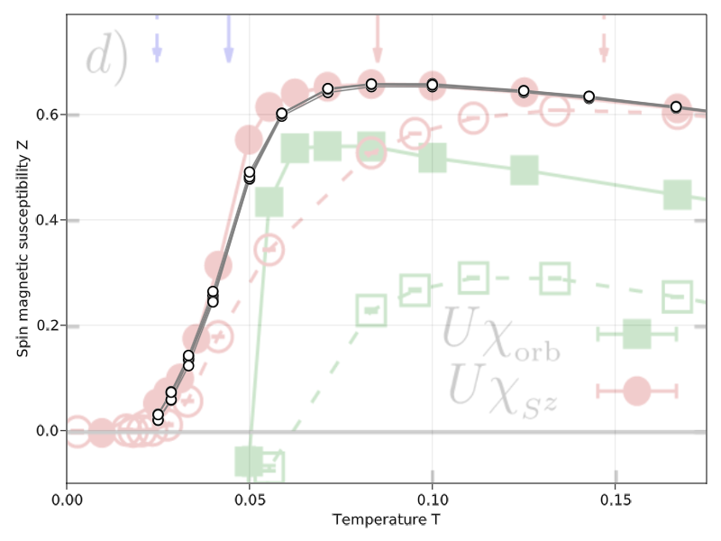
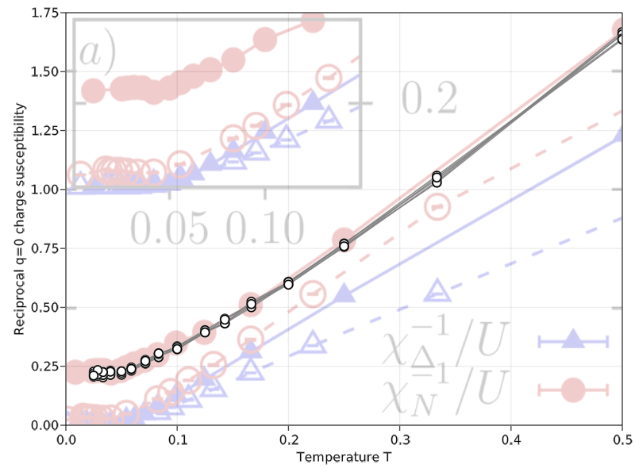
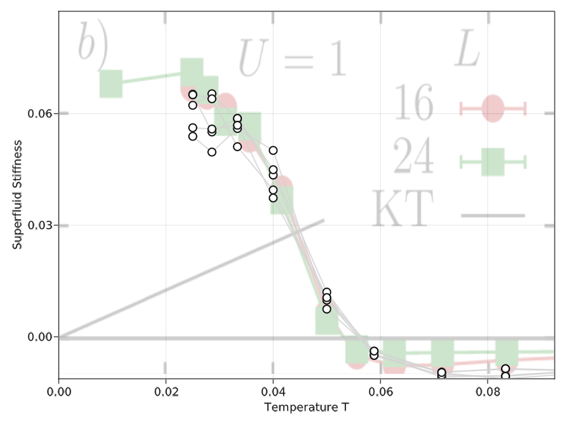

# Crosscheck with 2020 Paper

This will be a rather extensive example and crosscheck with the 2020 paper ["Superconductivity, pseudogap, and phase separation in topological flat bands:'a quantum Monte Carlo study"](https://journals.aps.org/prb/abstract/10.1103/PhysRevB.102.201112) ([arxiv](https://arxiv.org/pdf/1912.08848.pdf)) by Hofmann, Berg and Chowdhury. 

## Introduction

The paper investigates an attractive square lattice Hubbard model with complex hoppings up to the 5th order. It generates a flat and a dispersive band, where the flatness of the former can increased with the right ratio of hoppings. At partial filling of the flat band superconductivity is observed. The model reads

```math
\begin{aligned}
	H_{kin} &= \left[
        -t_1 \sum_{\langle i, j \rangle_1, \sigma} e^{i\phi_{ij}^\sigma} c_{i, \sigma}^\dagger c_{j, \sigma}
        -t_2 \sum_{\langle i, j \rangle_2, \sigma} s_{\langle i, j \rangle_2} c_{i, \sigma}^\dagger c_{j, \sigma}
        -t_5 \sum_{\langle i, j \rangle_5, \sigma} c_{i, \sigma}^\dagger c_{j, \sigma}
        + h.c.
    \right] - \mu \sum_i n_i \\
    H_{int} = - \frac{U}{2} \sum_i (n_i - 1)^2
\end{aligned}
```

where $$t_n$$ refers to n-th nearest neighbor hopping and $$\langle i, j \rangle_n$$ refers to the involved site pairs. We will discuss the prefactors more closely when implementing the lattice model. The interactive term is a variation of what we use in our standard attractive Hubbard model and can be dealt with using the same Hirsch transformation.


# Implementation


## The Lattice


The model is defined for a square lattice, however the paper suggests defining it via two site basis $$A = (0, 0)$$, $$B = (0, 1)$$ with lattice vector $$a_1 = (1, 1)$$ and $$a_2 = (1, -1)$$. We will follow this suggestion. The model uses first, second and fifth neighbor hoppings.

The nearest neighbors are directed, catching different values for $$\phi{ij}^\sigma$$ as a result. We need to create two groups, one with directions as indicated in figure 1a) in the paper, and one with the reverse. For second nearest neighbors the prefactor $$s_{\langle i, j \rangle_2}$$ depends on the combination of sublattice and direction. In $$a_1$$ direction the value is positive (negative) on the A (B) sublattice, and in $$a_2$$ it is negative (positive) on the A (B) sublattice. The fifth nearest neighbors always have the same weight and thus do not require special grouping.

We implement the lattice with [LatticePhysics.jl](https://github.com/janattig/LatticePhysics.jl). The package requires us to define a unitcell with all bonds we want to see in the full lattice. 

```julia
using LatticePhysics, LatPhysUnitcellLibrary

function LatPhysUnitcellLibrary.getUnitcellSquare(
            unitcell_type  :: Type{U},
            implementation :: Val{17}
        ) :: U where {LS,LB,S<:AbstractSite{LS,2},B<:AbstractBond{LB,2}, U<:AbstractUnitcell{S,B}}

    # return a new Unitcell
    return newUnitcell(
        # Type of the unitcell
        U,

        # Bravais lattice vectors
        [[1.0, +1.0], [1.0, -1.0]],
        
        # Basis sites
        S[
            newSite(S, [0.0, 0.0], getDefaultLabelN(LS, 1)),
            newSite(S, [0.0, 1.0], getDefaultLabelN(LS, 2))
        ],

        # Bonds
        B[
            # NN, directed
            # bonds from ref plot, π/4 weight for spin up
            newBond(B, 1, 2, getDefaultLabelN(LB, 1), (0, 1)),
            newBond(B, 1, 2, getDefaultLabelN(LB, 1), (-1, 0)),
            newBond(B, 2, 1, getDefaultLabelN(LB, 1), (+1, -1)),
            newBond(B, 2, 1, getDefaultLabelN(LB, 1), (0, 0)),

            # NN reversal
            newBond(B, 2, 1, getDefaultLabelN(LB, 2), (0, -1)),
            newBond(B, 2, 1, getDefaultLabelN(LB, 2), (+1, 0)),
            newBond(B, 1, 2, getDefaultLabelN(LB, 2), (-1, +1)),
            newBond(B, 1, 2, getDefaultLabelN(LB, 2), (0, 0)),
            
            # NNN
            # positive weight (forward and backward facing)
            newBond(B, 1, 1, getDefaultLabelN(LB, 3), (+1, 0)),
            newBond(B, 1, 1, getDefaultLabelN(LB, 3), (-1, 0)),
            newBond(B, 2, 2, getDefaultLabelN(LB, 3), (0, +1)),
            newBond(B, 2, 2, getDefaultLabelN(LB, 3), (0, -1)),
            # negative weight
            newBond(B, 1, 1, getDefaultLabelN(LB, 4), (0, +1)),
            newBond(B, 1, 1, getDefaultLabelN(LB, 4), (0, -1)),
            newBond(B, 2, 2, getDefaultLabelN(LB, 4), (+1, 0)),
            newBond(B, 2, 2, getDefaultLabelN(LB, 4), (-1, 0)),
            
            # Fifth nearest neighbors (forward)
            newBond(B, 1, 1, getDefaultLabelN(LB, 5), (2, 0)),
            newBond(B, 2, 2, getDefaultLabelN(LB, 5), (2, 0)),
            newBond(B, 1, 1, getDefaultLabelN(LB, 5), (0, 2)),
            newBond(B, 2, 2, getDefaultLabelN(LB, 5), (0, 2)),  
            # backwards facing bonds (backwards)
            newBond(B, 1, 1, getDefaultLabelN(LB, 5), (-2, 0)),
            newBond(B, 2, 2, getDefaultLabelN(LB, 5), (-2, 0)),
            newBond(B, 1, 1, getDefaultLabelN(LB, 5), (0, -2)),
            newBond(B, 2, 2, getDefaultLabelN(LB, 5), (0, -2)), 
        ]
    )
end
```

With this implementation we can then generate a lattice of arbitrary size with

```julia
L = 8
uc = LatticePhysics.getUnitcellSquare(17)
lpl = getLatticePeriodic(uc, L)
```

where `L` is the linear system size. Note that due to the two basis sites the total number of sites is $$2L^2$$. To verify our lattice implementation it is useful to create a comparable plot. In Makie, for example, we may run

```julia
using GLMakie

# get small lattice without periodic bonds
uc = LatticePhysics.getUnitcellSquare(17)
lpl = getLatticeOpen(uc, 3)

# create figure and axis without background grid and stretching
fig = Figure()
ax = Axis(fig[1, 1], aspect=DataAspect(), xgridvisible = false, ygridvisible = false)

# collect list of bonds grouped by label
ps = Point2f.(point.(sites(lpl)))
ls = [Point2f[] for _ in 1:5]
for b in bonds(lpl)
    push!(ls[b.label], ps[b.from], ps[b.to])
end

# Draw arrows for NN groups
ds = ls[1][2:2:end] .- ls[1][1:2:end]
arrows!(ax, ls[1][1:2:end] .+ 0.35 .* ds, 0.55 .* ds, color = :black)
ds = ls[2][2:2:end] .- ls[2][1:2:end]
arrows!(ax, ls[2][1:2:end] .+ 0.65 .* ds, 0.25 .* ds, color = :lightgray)

# NNN
linesegments!(ax, ls[3], color = :black, linewidth=1)
linesegments!(ax, ls[4], color = :black, linewidth=1, linestyle = :dash)

# 5th nearest neighbors
linesegments!(ax, ls[5] .+ Point2f(0, 0.05), color = :red)

# draw A and B sites
As = [Point2f(point(s)) for s in sites(lpl) if s.label == 1]
Bs = [Point2f(point(s)) for s in sites(lpl) if s.label == 2]
scatter!(ax, As, color = :black, markersize = 10)
scatter!(ax, Bs, color = :black, marker='■', markersize = 8)

# Label A and B sites
text!(ax, "A", position = Point2f(-0.2, 0), align = (:right, :center))
text!(ax, "B", position = Point2f(-0.2, 1), align = (:right, :center))

Makie.save("HBC_lattice.png", fig)
fig
```


In the plot we indicate the first group of nearest neighbors with black arrows and the second, i.e. the reversals with light gray ones. Next nearest neighbors are indicated with full (group 3) or dashed lines (group 4) like in the paper. The fifth nearest neighbors (group 5) are drawn in red like in the reference.


## Hopping and Interaction Matrix


Now that we have the lattice we can generate a fitting hopping matrix. But before we do this, let us briefly discuss some optimizations. 

[LoopVectorization.jl](https://github.com/JuliaSIMD/LoopVectorization.jl) is a great tool when pushing for peak single threaded/single core linear algebra performance. The linear algebra needed for DQMC is reimplemented in MonteCarlo.jl using it for both `Float64` and `ComplexF64`. The latter uses `MonteCarlo.CMat64` and `MonteCarlo.CVec64` as concrete array types which are based on [StructArrays.jl](https://github.com/JuliaArrays/StructArrays.jl) under the hood. They should be used in this model. Furthermore we can make use of `MonteCarlo.BlockDiagonal` as we have no terms with differing spin indices. Thus we set

```julia
MonteCarlo.@with_kw_noshow struct HBCModel{LT<:AbstractLattice} <: HubbardModel
    # parameters with defaults based on paper
    mu::Float64 = 0.0
    U::Float64 = 1.0
    @assert U >= 0. "U must be positive."
    t1::Float64 = 1.0
    t2::Float64 = 1.0 / sqrt(2.0)
    t5::Float64 = (1 - sqrt(2)) / 4

    # lattice
    l::LT

    # two fermion flavors (up, down)
    flv::Int = 2
    
    # temp storage to avoid allocations in propose_local and accept_local
    IG::CMat64  = StructArray(Matrix{ComplexF64}(undef, length(l), 2))
    IGR::CMat64 = StructArray(Matrix{ComplexF64}(undef, length(l), 2))
    R::Diagonal{ComplexF64, CVec64} = Diagonal(StructArray(Vector{ComplexF64}(undef, 2)))
end

MonteCarlo.hoppingeltype(::Type{DQMC}, ::HBCModel) = ComplexF64
MonteCarlo.hopping_matrix_type(::Type{DQMC}, ::HBCModel) = BlockDiagonal{ComplexF64, 2, CMat64}
MonteCarlo.greenseltype(::Type{DQMC}, ::HBCModel) = ComplexF64
MonteCarlo.greens_matrix_type( ::Type{DQMC}, ::HBCModel) = BlockDiagonal{ComplexF64, 2, CMat64}
```

for our model. The definition of the hopping matrix then follows from the various weights in the Hamiltonian as

```julia
function MonteCarlo.hopping_matrix(mc::DQMC, m::HBCModel{<: LatPhysLattice})
    # number of sites
    N = length(m.l)

    # spin up and spin down blocks of T
    tup = diagm(0 => fill(-ComplexF64(m.mu), N))
    tdown = diagm(0 => fill(-ComplexF64(m.mu), N))

    # positive and negative prefactors for t1, t2
    t1p = m.t1 * cis(+pi/4) # ϕ_ij^↑ = + π/4
    t1m = m.t1 * cis(-pi/4) # ϕ_ij^↓ = - π/4
    t2p = + m.t2
    t2m = - m.t2
    
    for b in bonds(m.l.lattice)
        # NN paper direction
        if b.label == 1 
            tup[b.from, b.to]   = - t1p
            tdown[b.from, b.to] = - t1m
        
        # NN reverse direction
        elseif b.label == 2
            tup[b.from, b.to]   = - t1m
            tdown[b.from, b.to] = - t1p
            
        # NNN solid bonds
        elseif b.label == 3
            tup[b.from, b.to]   = - t2p
            tdown[b.from, b.to] = - t2p

        # NNN dashed bonds
        elseif b.label == 4
            tup[b.from, b.to]   = - t2m
            tdown[b.from, b.to] = - t2m

        # Fifth nearest neighbors
        else
            tup[b.from, b.to]   = - m.t5
            tdown[b.from, b.to] = - m.t5
        end
    end

    return BlockDiagonal(StructArray(tup), StructArray(tdown))
end
```

We note that the hermitian conjugates of a hopping $$c_j^\dagger c_i$$ can also be understood as reversing the bond direction. Since we include both directions in our lattice definitions, second and fifth nearest neighbor hermitian conjugates are taken care of. First nearest neighbors get a phase shift from complex conjugation, which is included by swapping `t1p` and `t1m` between group one and two.

The interaction matrix can almost be copied from the repulsive Hubbard model. The only difference is that the spin up and spin down blocks get the same sign. 

```julia
@inline @bm function MonteCarlo.interaction_matrix_exp!(mc::DQMC, m::HBCModel,
            result::Diagonal, conf::HubbardConf, slice::Int, power::Float64=1.)
    dtau = mc.parameters.delta_tau
    lambda = acosh(exp(0.5 * m.U * dtau))
    N = length(lattice(m))
    
    # spin up block
    @inbounds for i in 1:N
        result.diag[i] = exp(sign(power) * lambda * conf[i, slice])
    end

    # spin down block
    @inbounds for i in 1:N
        result.diag[N+i] = exp(sign(power) * lambda * conf[i, slice])
    end
    nothing
end
```

In this case we do not need to set the type for the interaction matrix explicitly like we did for the hopping and greens matrices, because the (abstract) `HubbardModel` already uses `Diagonal` interaction matrices.


## Local Updates


Our next task is to implement `propose_local!` and `accept_local!`. Since those only rely on specific indices, columns or rows for a large part of their calculation we have to dig into the optimized matrix types a bit. `propose_local` aims to calculate the determinant ratio $$R$$ and bosonic energy difference $$\Delta E_Boson = V(C_{new}) - V(c_{old})$$ where $$C$$ is the auxiliary field configuration. The determinant ratio is defined as

```math
R = \prod_\sigma \left[
        1 + \left( \exp(\Delta E_Boson) - 1 \right) 
        \left( 1 - G_{ii}^{\sigma, \sigma}(\tau, \tau) \right)
    \right]
```

where $$i$$ and $$\tau$$ are the lattice index and time slice index of the proposed change in the auxiliary field. This formula already assumes that the greens matrix $$G$$ is zero for all differing spin indices (i.e. spin up-down or down-up). Therefore it is just a product of two terms. With this `propose_local` is implemented as

```julia
@inline @bm function MonteCarlo.propose_local(
        mc::DQMC, model::HBModel, i::Int, slice::Int, conf::HubbardConf
    )
    N = length(model.l)
    G = mc.stack.greens
    Δτ = mc.parameters.delta_tau
    R = model.R

    α = acosh(exp(0.5Δτ * model.U))
    ΔE_boson = -2.0α * conf[i, slice]
    Δ = exp(ΔE_boson) - 1.0

    # Unrolled R = I + Δ * (I - G)
    # up-up term
    R.diag.re[1] = 1.0 + Δ * (1.0 - G.blocks[1].re[i, i])
    R.diag.im[1] = - Δ * G.blocks[1].im[i, i]
    # down-down term
    R.diag.re[2] = 1.0 + Δ * (1.0 - G.blocks[2].re[i, i])
    R.diag.im[2] = - Δ * G.blocks[2].im[i, i]

    # Calculate "determinant"
    detratio = ComplexF64(
        R.diag.re[1] * R.diag.re[2] - R.diag.im[1] * R.diag.im[2],
        R.diag.re[1] * R.diag.im[2] + R.diag.im[1] * R.diag.re[2]
    )
    
    return detratio, ΔE_boson, Δ
end
```

Note that the fields of our special matrix types are directly indexed here. A `BlockDiagonal` matrix contains all of its data in `B.blocks`. We define the first (upper left) block as spin up and the second (lower right) as spin down. Sitting at each block is a complex matrix represented by `CMat64`. It contains two real valued matrices at `x.re` and `x.im` representing the real and imaginary parts respectively.

For `accept_local`  we need to update the auxiliary field and the currently active greens function. To avoid recalculating $$\Delta$$ it is returned in `propose_local` and will be passed to `accept_local`. The updated greens function is given by

```math
G_{jk}^{\sigma \sigma^\prime} = 
    G_{jk}^{\sigma \sigma^\prime} -
    \left(I - G^{\sigma \sigma^\prime}(\tau, \tau) \right)_{ji}
    R_{\sigma, \sigma^\prime}^{-1} 
    \Delta_{ii}^{\sigma \sigma^\prime}(\tau)
    G_{ik}^{\sigma \sigma^\prime}(\tau, \tau)
```

where $$i$$ is again the site index of the proposed flip. Let's go through some observations/simplifications. First we note that for $$\sigma \ne \sigma^\prime$$ the greens function is and remains zero. The inversion of $$R$$ is an inversion of a diagonal matrix and thus simplifies to calculating the inverse of each element. Finally, $$\Delta$$ has the same value for spin up and spin down so it is simply a number.

Using these observations and applying optimizations relevant to our matrix types `accept_local` can be implemented as

```julia
@inline @bm function MonteCarlo.accept_local!(
        mc::DQMC, model::HBModel, i::Int, slice::Int, conf::HubbardConf, 
        detratio, ΔE_boson, Δ)

    @bm "accept_local (init)" begin
        N = length(model.l)
        G = mc.stack.greens
        IG = model.IG
        IGR = model.IGR
        R = model.R
    end
    
    # compute R⁻¹ Δ, using that R is Diagonal, Δ is Number
    # using Δ / (a + ib) = Δ / (a^2 + b^2) * (a - ib)
    @bm "accept_local (inversion)" begin
        f = Δ / (R.diag.re[1]^2 + R.diag.im[1]^2)
        R.diag.re[1] = +f * R.diag.re[1]
        R.diag.im[1] = -f * R.diag.im[1]
        f = Δ / (R.diag.re[2]^2 + R.diag.im[2]^2)
        R.diag.re[2] = +f * R.diag.re[2]
        R.diag.im[2] = -f * R.diag.im[2]
    end

    # Compute (I - G) R^-1 Δ
    # Note IG is reduced to non-zero entries. Full IG would be
    # (I-G)[:, i]        0
    #     0         (I-G)[:, i+N]
    # our IG is [(I-G)[:, i]  (I-G)[:, i+N]]
    @bm "accept_local (IG, R)" begin
        # Calculate IG = I - G (relevant entries only)
        @turbo for m in axes(IG, 1)
            IG.re[m, 1] = -G.blocks[1].re[m, i]
        end
        @turbo for m in axes(IG, 1)
            IG.re[m, 2] = -G.blocks[2].re[m, i]
        end
        @turbo for m in axes(IG, 1)
            IG.im[m, 1] = -G.blocks[1].im[m, i]
        end
        @turbo for m in axes(IG, 1)
            IG.im[m, 2] = -G.blocks[2].im[m, i]
        end
        IG.re[i, 1] += 1.0
        IG.re[i, 2] += 1.0
        
        # Calculate IGR = IG * R where R = R⁻¹ Δ from the 
        # previous calculation (relevant entries only)
        # spin up-up block 
        @turbo for m in axes(IG, 1)
            IGR.re[m, 1] = IG.re[m, 1] * R.diag.re[1]
        end
        @turbo for m in axes(IG, 1)
            IGR.re[m, 1] -= IG.im[m, 1] * R.diag.im[1]
        end
        @turbo for m in axes(IG, 1)
            IGR.im[m, 1] = IG.re[m, 1] * R.diag.im[1]
        end
        @turbo for m in axes(IG, 1)
            IGR.im[m, 1] += IG.im[m, 1] * R.diag.re[1]
        end
        
        # spin down-down block
        @turbo for m in axes(IG, 1)
            IGR.re[m, 2] = IG.re[m, 2] * R.diag.re[2]
        end
        @turbo for m in axes(IG, 1)
            IGR.re[m, 2] -= IG.im[m, 2] * R.diag.im[2]
        end
        @turbo for m in axes(IG, 1)
            IGR.im[m, 2] = IG.re[m, 2] * R.diag.im[2]
        end
        @turbo for m in axes(IG, 1)
            IGR.im[m, 2] += IG.im[m, 2] * R.diag.re[2]
        end
    end

    # Update G according to G = G - (I - G)[:, i:N:end] * R⁻¹ * Δ * G[i:N:end, :]
    # We already have IG = (I - G)[:, i:N:end] * R⁻¹ * Δ
    @bm "accept_local (finalize computation)" begin
        # get blocks to write less
        G1 = G.blocks[1]
        G2 = G.blocks[2]
        temp1 = mc.stack.greens_temp.blocks[1]
        temp2 = mc.stack.greens_temp.blocks[2]

        # compute temp = IG[:, i:N:end] * G[i:N:end, :]
        # spin up-up block
        @turbo for m in axes(G1, 1), n in axes(G1, 2)
            temp1.re[m, n] = IGR.re[m, 1] * G1.re[i, n]
        end
        @turbo for m in axes(G1, 1), n in axes(G1, 2)
            temp1.re[m, n] -= IGR.im[m, 1] * G1.im[i, n]
        end
        @turbo for m in axes(G1, 1), n in axes(G1, 2)
            temp1.im[m, n] = IGR.im[m, 1] * G1.re[i, n]
        end
        @turbo for m in axes(G1, 1), n in axes(G1, 2)
            temp1.im[m, n] += IGR.re[m, 1] * G1.im[i, n]
        end
        
        # spin down-down block
        @turbo for m in axes(G2, 1), n in axes(G2, 2)
            temp2.re[m, n] = IGR.re[m, 2] * G2.re[i, n]
        end
        @turbo for m in axes(G2, 1), n in axes(G2, 2)
            temp2.re[m, n] -= IGR.im[m, 2] * G2.im[i, n]
        end
        @turbo for m in axes(G2, 1), n in axes(G2, 2)
            temp2.im[m, n] = IGR.im[m, 2] * G2.re[i, n]
        end
        @turbo for m in axes(G2, 1), n in axes(G2, 2)
            temp2.im[m, n] += IGR.re[m, 2] * G2.im[i, n]
        end

        # Calculate G = G - temp
        # spin up-up block
        @turbo for m in axes(G1, 1), n in axes(G1, 2)
            G1.re[m, n] = G1.re[m, n] - temp1.re[m, n]
        end
        @turbo for m in axes(G1, 1), n in axes(G1, 2)
            G1.im[m, n] = G1.im[m, n] - temp1.im[m, n]
        end
        
        # spin down-down block
        @turbo for m in axes(G2, 1), n in axes(G2, 2)
            G2.re[m, n] = G2.re[m, n] - temp2.re[m, n]
        end
        @turbo for m in axes(G2, 1), n in axes(G2, 2)
            G2.im[m, n] = G2.im[m, n] - temp2.im[m, n]
        end

        # Update configuration
        conf[i, slice] *= -1
    end

    nothing
end
```


## Utilities and other functionality


Now that we have the lattice, the hopping and interaction matrix as well as `propose_local` and `accept_local!` we're done implementing the model. There are a couple of things one might want to add. For example, adding `energy_boson()` would enable global updates and boson energy measurements. Adding `save_model` and `_load` should help with reducing file size and help future proof things, but isn't strictly necessary. And adding `intE_kernel` would allow the interactive and total energy to be measured. Beyond that one might add some constructors and convenience function like `parameters`. 

The full code including these convenience functions can be found [here](HBC_model.jl)


# Simulation Setup


To keep the runtime of this crosscheck reasonable we used the smallest linear system size the paper considers, `L = 8`. We also set `U = 1` and the fifth nearest neighbor hopping `t5 = 0`. This corresponds to a flatness ratio $$F = 0.2$$. To be comparable to the paper we will need to tune the chemical potential $$\mu$$ to hit half filling. This can be done through trial and error on a smaller lattice. The optimal $$\mu$$, after running the main simulation with a small set of different values, seems to be $$\mu \approx -2.206$$. Thus the basic setup for our simulation becomes

```julia
uc = LatticePhysics.getUnitcellSquare(17)
lpl = getLatticePeriodic(uc, 8)
l = LatPhysLattice(lpl)
m = HBModel(l, t5 = 0.0, mu = -2.206) # other defaults match F = 0.2 setup
mc = DQMC(
    m, beta = beta, thermalization = 1000, sweeps = 5000, 
    measure_rate = 5, print_rate = 100, recorder = Discarder()
)
```

where beta needs to run over a reasonable set of inverse temperatures. We will use `[2.0, 3.0, 4.0, 5.0, 6.0, 7.0, 8.0, 10.0, 12.0, 14.0, 17.0, 20.0, 25.0, 30.0, 35.0, 40.0]`. 

!!! note

    In our actual simulation we used a `BufferedConfigRecorder` to record configurations. That way the simulation can be replayed with different measurements. This is very useful when you are still unsure about what you want to measure or how exactly those measurements are supposed to work.

## Measurements

We will consider the following measurements for comparison:

1. Z-spin susceptibility, solid red line in figure 1d)
2. Superfluid stiffness, figure 2b)
3. Reciprocal s-wave pairing susceptibility, solid red line in figure 4a)
4. Reciprocal charge susceptibility, solid blue line in figure 4a)

#### Z-Spin Susceptibility

The z-spin susceptibility $$\int_0^\beta d\tau \langle m_z(r^\prime, \tau) m_z(r, 0) \rangle$$ can be measure with

```julia
mc[:SDSz] = spin_density_susceptibility(mc, m, :z)
```

The integral will be evaluated by MonteCarlo.jl and the result, accessible with `mean(mc[:SDCz])`, will return the average result by direction. I.e. `mean(mc[:SDCz])[i]` will contain the average z-spin susceptibility in `directions(mc)[i]`.

#### Reciprocal Charge Susceptibility

The paper defines the charge susceptibility as $$\int_0^\beta d\tau \langle N(\tau) N(0) \rangle$$ where $$N(\tau) = \sum_j (n_j(\tau) - \nu)$$ and $$\nu$$ is the filling. The charge density susceptibility that MonteCarlo.jl defines, on the other hand, is $$\langle n_j(\tau) n_i(0)\rangle$$. To connect these two we expand the papers' definition:

```math
\begin{aligned}
	\langle N(\tau) N(0) \rangle 
        &= \langle \sum_j (n_j(\tau) - \nu) \sum_i (n_i(0) - \nu) \rangle \\
        &= \sum_{ij} \langle n_j(\tau) n_i(0) - n_j(\tau) \nu - \nu n_i(0) + \nu \nu \rangle \\
        &= \sum_{ij} \langle n_j(\tau) n_i(0) \rangle - \langle \sum_i n_i \rangle^2
\end{aligned}
```

In the last step we associated $$\nu = \sum_i \langle n_i \rangle / N$$, i.e. the average occupation. We can use this representation to calculate the reciprocal charge susceptibility as $$1 / (O - \nu^2)$$ where $$O$$ is MonteCarlo.jl's charge density susceptibility and $\nu$ is the average occupation. We measure

```julia
mc[:occ] = occupation(mc, m)
mc[:CDS] = charge_density_susceptibility(mc, m)
```

#### Reciprocal S-Wave Pairing Susceptibility

The paper defines the (s-wave) pairing susceptibilities as $$O(\tau) = \sum_j c_{j, \uparrow} c_{j, \downarrow} + h.c.$$. More generally you would consider a site offset between the pairs of operators and use weighted sums to get pairing susceptibilities of various symmetries like d-wave, p-wave, etc. For s-wave this offset is $$\vec{0}$$. In MonteCarlo.jl these offsets are set via the lattice iterator. For example you may use `EachLocalQuadByDistance([2, 4, 5])` to consider the `directions(mc)[[2, 4, 5]]` as offsets. 

The `pairing_suceptibility` constructors from MonteCarlo.jl is written with these offsets in mind. By default it will include offsets for all nearest neighbors as well as offsets of $$\vec{0}$$. To reduce computational complexity we may reduce these to just $$\vec{0}$$ offsets by requesting just first offset:


```julia
mc[:PS] = pairing_susceptibility(mc, m, 1)
```

#### Superfluid Stiffness

The superfluid stiffness is given by $$0.25 [- K_x - \Lambda_{xx}(q = 0)]$$ in the paper. Both the diamagnetic contribution $$K_x$$ and the Fourier transformed current-current correlation $$\Lambda_{xx}(q)$$ are things we need to measure individually.

The diamagnetic contribution $$K_x$$ is the simpler one. For that we refer to equations 15a - 15j in the paper. The sum of all of these is the $$K_x$$ we seek. Since all terms are quadratic in creation and annihilation operators we do not need to worry about expanding them with Wicks theorem. Instead we can simply measure the Greens matrix during the simulation. If we compare the equations with the Hamiltonian we will also notice that they are (almost) the same as the hopping terms. Thus we can get weights from the hopping matrix and apply them afterwards. We measure

```julia
mc[:G] = greens_measurement(mc, model)
```

For the current-current correlations we need to measure $$\int_0^\beta d \tau \langle J_x^\alpha(r^\prime, \tau) J_x^\beta(r, 0) \rangle$$ where $$J_x(r, \tau)$$ is given in equation 14a - 14j. These terms are already implemented by MonteCarlo.jl, but we should briefly discuss them regardless. (We will leave the Fourier transform for later.) 

Much like $$K_x$$ these terms are closely related to the hopping terms of the Hamiltonian. The index $$\alpha$$ ($$\beta$$) refers to the direction of the hopping. Each term contains a hopping in +x direction weighted by $$i$$ and a hopping in the opposite direction weighted by $$-i$$ via the Hermitian conjugate. The fifth nearest neighbor terms also catch a factor 2. For the measurement we need to apply Wicks theorem to every combination of any two currents $$J^\alpha_x$$ and also take care of an implied spin index. The result can be found in the `cc_kernel` in MonteCarlo.jl.

Let's get back to what we need to measure in our simulation. MonteCarlo.jl's `current_current_susceptibility` measures $$\int_0^\beta d \tau \langle J_x^\alpha(r^\prime, \tau) J_x^\beta(r, 0) \rangle$$ where $$\alpha$$ and $$\beta$$ are directions that get passedto the function. Since we set `t5 = 0` we can ignore equations 14g - 14j leaving 6 equations with 3 directions on 2 sublattices. MonteCarlo.jl does not care about sublattices, so we're left with three +x directions `[2, 6, 9]` which need to be passed. You can check these with `directions(mc)[[2, 6, 9]]` against the paper. Our measurement is given by

```julia
mc[:CCS] = current_current_susceptibility(mc, model, [2, 6, 9])
```

## Running the simulations

To run the simulation we simply use `run!(mc)`.

We should point out that these simulations are lot more complex than the other two examples. We are working with 128 sites as opposed to 16 and inverse temperatures as large as 40 instead of $$\le 12$$. We are also using complex matrices which bring $$2 - 4$$ times the complexity and we need to consider both a spin up and down sector in the greens matrix. 

It is therefore advised that you run this on a cluster, in parallel. To figure out how much time is needed you can check the sweep time for the smallest $$\beta$$ with measurements. The scaling should be roughly linear (w.r.t. $$\beta$$). Note that you can pass a `safe_before::TimeType` to make sure the simulation saves and exits in time. If your cluster restricts you to full nodes it might be useful to create files for each simulation beforehand and distribute filenames to different cores on the same node. (src/mpi.jl might be helpful.)


# Results


In this section we plot the results from our simulations on top of the results from the paper. There are 5 points per temperature coming from different chemical potentials $$\mu$$. The filling varies from 0.22 to 0.265 between them. Note also that not every simulation did the full number of sweeps. The shortest simulation ran for about 3000 sweeps, which includes 1000 thermalization sweeps.


## Z-Spin Susceptibility

To get the results from the paper we need to perform a $$q = 0$$ Fourier transform which is simply a sum. We calculate `real(sum(mean(mc[:SDCz])))` and plot against `1 / mc.parameters.beta`.




## Reciprocal Charge Susceptibility

For the reciprocal charge susceptibility we plot

```julia
CDS = real(sum(mean(mc[:CDS])))
occ = real(sum(mean(mc[:occ])))
xs = 1 / mc.parameters.beta
ys = 1 / (CDS - mc.parameters.beta * occ^2 / length(lattice(mc)))
```

where the factor `mc.parameters.beta / length(lattice(mc))` comes from the imaginary time integral.




## Reciprocal Pairing Susceptibility

The pairing susceptibility comes with three directional indices after taking `mean(mc[:PS])`. The first is associated with the distance $$r - r^\prime$$ between the two pairing operators $$\Delta(r)$$ in $$\langle \Delta^\alpha(r) \Delta^\beta(r^\prime) \rangle$$. The second and third are displacements inside them. Since we only care about s-wave pairing the internal displacements are zero or index 1. Thus we plot `1 / real(sum(mean(mc[:PS])[:, 1, 1]))` against `1 / mc.parameters.beta` for the reciprocal pairing susceptibility. 


## Superfluid Stiffness

The superfluid stiffness still requires a good amount of work. Let's start with the diamagnetic contribution $$K_x$$. As mentioned before the prefactors of $$K_x$$ match those of the hoppings in the Hamiltonian (except for 5th nearest neighbors which catch a factor of 4). The expectation values for $$\langle c_j^\dagger c_i \rangle$$ follow from the measured Greens function $$G_{ij} = c_i c_j^\dagger$$ as $$\delta_{ij} - G{ji}$$ (permutation of operators).

To pick the correct sites we can poke at the backend of the lattice iterator interface. There are a few maps that get cached, one of which returns a list of (source, target) site index pairs given a directional index. It can be fetched (and potentially generated) via `dir2srctrg = mc[Dir2SrcTrg()]`. The relevant directional indices can be determined from `directions(mc)`. Using that we calculate the total diamagnetic contribution $$K_x$$ as

```julia
function dia_K_x(mc)
    # directional indices for K_x (see directions(mc)[idxs]
    # These correspond to 
    # K1 & K4, K1 & K4 h.c., K2 & K5, K3 & K6 h.c., K2 & K5 h.c., K3 & K5
    idxs = [2, 4, 6, 7, 8, 9]
    
    # T contains the prefactors used in K_x, G contains ⟨c_i c_j^†⟩
    T = Matrix(MonteCarlo.hopping_matrix(mc, mc.model))
    G = mean(mc[:G])

    # We use the dir2srctrg map to get all (src, trg) pairs relevant to the 
    # directions we specified with `idxs` above
    dir2srctrg = mc[MonteCarlo.Dir2SrcTrg()]
    N = length(lattice(mc))
    
    Kx = ComplexF64(0)
    for dir_idx in idxs
        for (src, trg) in dir2srctrg[dir_idx]
            # c_j^† c_i = δ_ij - G[i, j], but δ always 0 (no onsite)
            Kx -= T[trg, src] * G[src, trg]         # up-up
            Kx -= T[trg+N, src+N] * G[src+N, trg+N] # down-down
        end
    end

    # normalize
    Kx /= N
end
```

For the Fourier transformed current-current correlation $$\Lambda_{xx}(q)$$ the paper uses two summations. The first (eq. 16) runs over positions without offsets from the basis. The second (eq. 17) then resolves those offsets with a shift by $$\hat{e}_y$$ and also translates positions to the centers of the two sites involved with each hopping term. Combining both equations in a MonteCarlo.jl compatible style yields

```math
\begin{equation}
    \Lambda_{xx}(q) = \sum_{\Delta r_{12}} \sum_{\Delta r_1, \Delta r_2} e^{- i q (\Delta r_{12} + 0.5 (\Delta r_1 - \Delta r_2))}
                      \int_0^\beta \sum_{r_0} \langle J_x^{\Delta r_1}(r_0 + \Delta r_{12}, \tau) J_x^{\Delta r_2}(r_0, 0) \rangle d\tau
\end{equation}
```

Here $$\Delta r_{12}$$ is the distance between any two sites including basis offsets and $$\Delta r_1$$ and $$\Delta r_2$$ are the hopping distances. The integral over imaginary time and the sum over $$r_0$$ are already performed during measuring. This leaves the following to be calculated after measuring:

```julia
function para_ccc(mc, q)
    # direction indices for J1 & J4, J2 & J5, J3 & J6 (h.c. included in measurement)
    idxs = [2, 6, 9]

    CCS = mean(mc[:CCS])
    dirs = directions(lattice(mc))
    Λxx = ComplexF64(0)

    for (i, dir) in enumerate(dirs)
        for j in idxs, k in idxs
            Λxx += CCS[i, j, k] * cis(-dot(dir + 0.5(dirs[j] .- dirs[k]), q))
        end
    end
    
    Λxx
end
```

To compute the superfluid stiffness we now just calculate $$D_S = \frac{1}{4} [ -K_x - \Lambda_{xx}(q = 0)]$$ (eq. 4).

