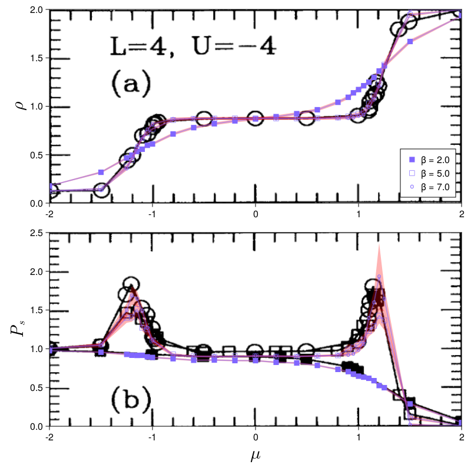
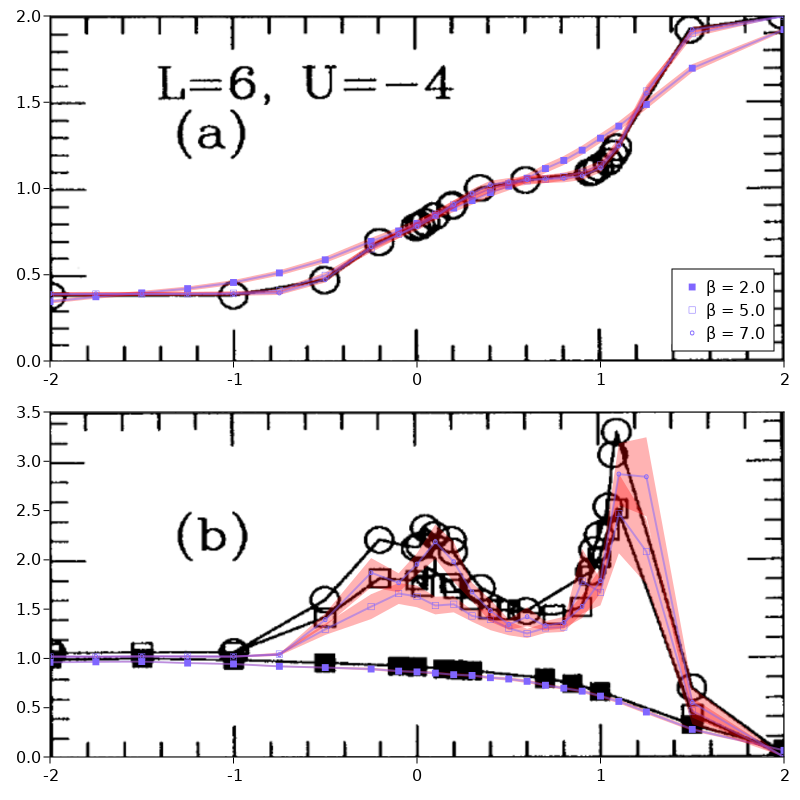
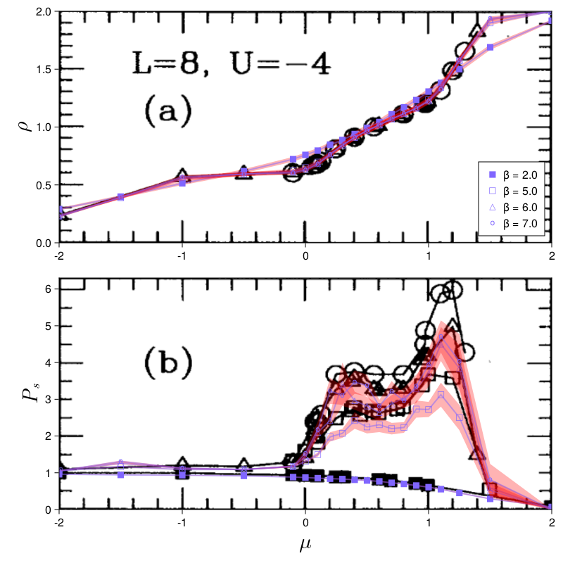
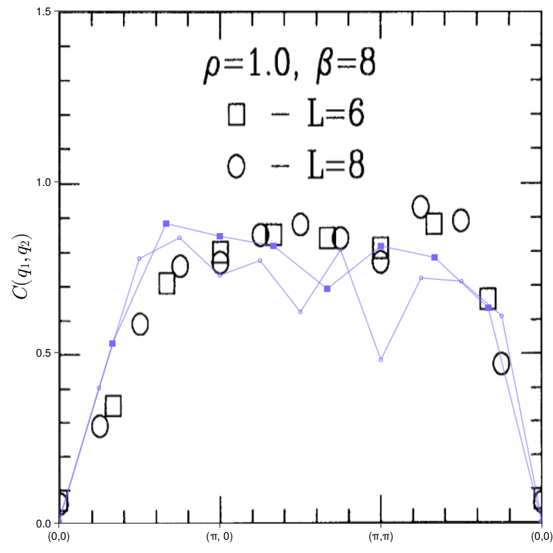
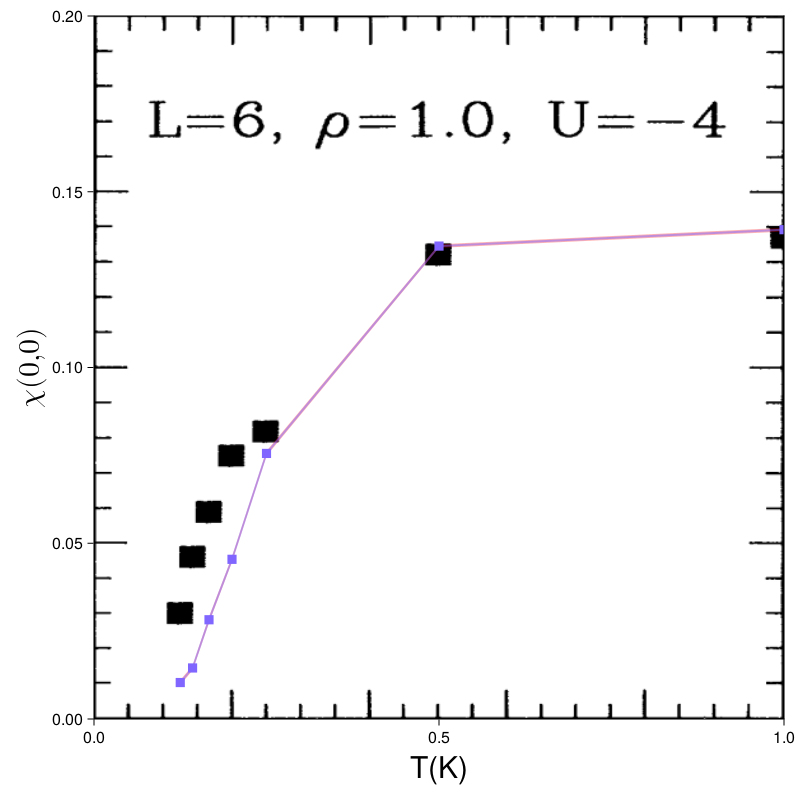

# Triangular Attractive Hubbard 

This example implements the model from the paper [Attractive Hubbard model on a triangular lattice](https://journals.aps.org/prb/abstract/10.1103/PhysRevB.48.3976). This also serves as a cross-check for the DQMC and a few measurements, such as pairing correlations and occupations. 

### Simulation

In the paper simulations were done with $500-1000$ sweeps and $\Delta\tau = 0.125$. Occupations are measured the same way as in MonteCarlo.jl. Pairing correlations seem to use $$\Delta \Delta^\dagger$$ rather than the $$\Delta^\dagger \Delta + \Delta \Delta^\dagger$$ given in the paper. The latter is the default in MonteCarlo.jl. To have the former we need to explicitly pass `kernel = MonteCarlo.pc_kernel`.

The first figure is done with interaction strength $U = -4$, linear system size $L = 4$ at $\beta = 2, 5, 7$ for varying $\mu$. The following simulations should take about 2 minutes.

```julia
using MonteCarlo

betas = (2.0, 5.0, 7.0)
mus = vcat(-2.0, -1.5, -1.25:0.05:-1.0, -0.8:0.2:0.8, 0.9:0.05:1.25, 1.5, 2.0)
lattice = TriangularLattice(4)
dqmcs = []

counter = 0
N = length(mus) * length(betas)
@time for beta in betas, mu in mus
    counter += 1
    print("\r[", lpad("$counter", 2), "/$N]")
    m = HubbardModelAttractive(l = lattice, t = 1.0, U = 4.0, mu = mu)
    dqmc = DQMC(
        m, beta = beta, delta_tau = 0.125, safe_mult = 8, 
        thermalization = 1000, sweeps = 1000, measure_rate = 1,
        recorder = Discarder
    )
    dqmc[:occ] = occupation(dqmc, m)
    dqmc[:PC] = pairing_correlation(dqmc, m, kernel = MonteCarlo.pc_kernel)
    run!(dqmc, verbose = false)

    # for simplicity we just keep the whole simulation around
    push!(dqmcs, dqmc)
end
```

### Processing Data

After running all the simulations we need to do a little bit of post-processing on the measured data. 

```julia
N = length(mus)
occs = []
Δoccs = []
pcs = []
Δpcs = []

for i in 0:2
    # Measurements are saved in a LogBinner from BinningAnalysis by default.
    # Taking the mean (std_error) of a LogBinner will return the Monte Carlo 
    # average (error). Occupation measurements happen per site, so we need 
    # another mean afterwards. 
    _occs = [2 * mean(mean(dqmcs[N*i + j][:occ])) for j in 1:N]
    doccs = [2 * sqrt(mean(std_error(dqmcs[N*i + j][:occ]).^2)) for j in 1:N]
    push!(occs, _occs)
    push!(Δoccs, doccs)

    # pairing correlations are saved in a partially processed state - a 3D matrix
    # where each index corresponds to vectors between sites
    # y_{i, j, k} = ∑_x ⟨c_{x, ↑} c_{x+j, ↓} c_{x+i+k, ↓}^† c_{x+i, ↑}^†
    # The vectors corresponding to the indices i, j, k are returned by 
    # directions(lattice(dqmc)). To compute the pairing correlation of a certain
    # symmetry, we need to apply the weights corresponding vector indices j, k.
    # For s-wave symmetry these weights are always (1, 0, ..., 0) (only vector 0).
    # To match the paper the index i should just be summed over. This is 
    # equivalent to a q=0 Fourier transform.
    _pcs = [sum(mean(dqmcs[N*i + j][:PC])[:, 1, 1]) for j in 1:N]
    dpcs = [sqrt(sum(std_error(dqmcs[N*i + j][:PC])[:, 1, 1].^2)) for j in 1:N]
    push!(pcs, _pcs)
    push!(Δpcs, dpcs)
end
```

### Plotting

With the data in a processed form we can now plot it. To make comparison easier, we plot our data directly over figure 1 from our [reference](https://journals.aps.org/prb/abstract/10.1103/PhysRevB.48.397).

```julia
using CairoMakie, FileIO, Colors


fig = Figure(resolution = (800, 800))
top = Axis(fig[1, 1])
bot = Axis(fig[2, 1])

# References
p = pkgdir(MonteCarlo)
top_ref = FileIO.load(joinpath(p, "docs/src/examples/assets/triangular/tri_Hub_ref1_1.png"))
bot_ref = FileIO.load(joinpath(p, "docs/src/examples/assets/triangular/tri_Hub_ref1_2.png"))
ip = image!(top, -2..2, 0..2, top_ref'[:, end:-1:1])
translate!(ip, 0, 0, -1)
ip = image!(bot, -2..2, 0..2.5, bot_ref'[:, end:-1:1], transparency=true)
translate!(ip, 0, 0, -1)

c = HSV(250, 0.6, 1)
for (i, (ys, dys)) in enumerate(zip(occs, Δoccs))
    band!(top, mus, ys .- dys, ys .+ dys, color = (:red, 0.3))
    lines!(top, mus, ys, color = (c, 0.5), linewidth=2)
    scatter!(top, mus, ys, color = c, marker = ('■', '□', 'o')[i])
end

axislegend(top, top.scene.plots[4:3:end], ["β = 2", "β = 5", "β = 7"], position = :rb)

for (i, (ys, dys)) in enumerate(zip(pcs, Δpcs))
    band!(bot, mus, ys .- dys, ys .+ dys, color = (:red, 0.3), transparency=true)
    lines!(bot, mus, ys, color = (c, 0.5), linewidth=2)
    scatter!(bot, mus, ys, color = c, marker = ('■', '□', 'o')[i])
end

xlims!(top, -2 , 2)
ylims!(top, 0 , 2)
xlims!(bot, -2 , 2)
ylims!(bot, 0 , 2.5)

CairoMakie.save(joinpath(p, "docs/src/examples/assets/triangular/fig1_comparison.png"), fig)
```



### Other runs

The [paper](https://journals.aps.org/prb/abstract/10.1103/PhysRevB.48.3976) has two more versions of the above plot for system sizes $L = 6$ and $L = 8$. These show significantly different results.

For $L = 6$ we use `mus = vcat(-2.0:0.25:-0.25, -0.1:0.1:1.1, 1.25, 1.5, 2.0)` with the same parameters other than that. The simulation should take about 5 minutes.



For $L=8$ we use `mus = vcat(-2.0:0.5:-0.5, -0.1:0.1:1.1, 1.25, 1.5, 2.0)` and `betas = (2.0, 5.0, 6.0, 7.0)`. The resulting simulation takes about 30min.



#### Charge Density Structure Factor

The paper also investigates the charge density structure factor as a function of reciprocal lattice vectors $q$. In general structure factors can be computed from correlations via Fourier transform. In this case it is not quite as simple since MonteCarlo.jl implements $\langle n_i n_j \rangle$ while the paper uses $\langle n_i n_j \rangle - \langle n_i \rangle \langle n_j \rangle$. As such we need to implement our own reduced charge density correlation measurement. First we need to figure out what this observable looks like in terms of Greens function elements.

```math
\begin{aligned}
	\langle n_{i, s} n_{j, s^\prime} \rangle - \langle n_{i, s} \rangle \langle n_{j, s^\prime} \rangle
	&= \langle c_{i, s}^\dagger c_{i, s} c_{j, s^\prime}^\dagger c_{j, s^\prime} \rangle  - \langle n_{i, s} \rangle \langle n_{j, s^\prime} \rangle\\
	&= \langle c_{i, s}^\dagger c_{i, s} \rangle \langle c_{j, s^\prime}^\dagger c_{j, s^\prime} \rangle + \langle c_{i, s}^\dagger c_{j, s^\prime} \rangle \langle c_{i, s} c_{j, s^\prime}^\dagger \rangle  - \langle n_{i, s} \rangle \langle n_{j, s^\prime} \rangle\\
	&= (\delta_{ij} \delta_{ss^\prime} - G_{ji}^{s^\prime s}) G_{ij}^{ss^\prime}
\end{aligned}
```

Here we expanded the term into creation and annihilation operators, applied Wicks theorem and finally used $G_{ij}^{ss^\prime} = \langle c_i c_j^\dagger \rangle$ to express the term with Greens function elements. (We note that expectation values of two creation or two annihilation operators are always zero in DQMC and are therefore dropped.) For the attractive Hubbard model, greens function elements with different spins $G_{ij}^{ss^\prime}$ are zero and $G_{ij}^{\uparrow\uparrow} = G_{ij}^{\downarrow\downarrow}$. Thus the full expectation value is given by

```math
\langle n_i n_j \rangle - \langle n_{i, s} \rangle \langle n_{j, s^\prime} \rangle = 2 (\delta_{ij} - G_{ji}) G_{ij}
```

which needs to be implemented as a function and passed to `MonteCarlo.Measurement` to be used.

```julia
function my_kernel(::DQMC, ::HubbardModelAttractive, ij::NTuple{2}, G::AbstractArray)
    i, j = ij
    4 * (I[j, i] - G[j, i]) * G[i, j]
end

dqmc[:CDC] = MonteCarlo.Measurement(mc, model, Greens, EachSitePairByDistance, my_kernel)
```

In the above, `Greens` is a greens function iterator used by the measurement. It yields an equal time greens function to the measurement which is eventually passed as `G` to the kernel. `EachSitePairByDistance` defines which lattice indices are passed to the kernel and how they are saved. In this case i and j run through each site index independently and the results are summed such that we have one value per unique distance vector.

With that measurement we can now compare to the paper. We simulate with $L = 6, 8$, $\beta = 8$, $\mu = 0$ and $|U| = 4$, which should take about a minute.

To match the paper we simulate $L = 6, 8$, $\beta = 8$, $\mu = 0$ and $U = -4$ with the new measurement. This should take about a minute. After the simulation we compute the fourier transform at various $q$ with

```julia
qs = vcat(
    range(Float64[0, 0],   Float64[pi, 0], length=10),
    range(Float64[pi, 0],  Float64[pi, pi], length=10),
    range(Float64[pi, pi], Float64[0, 0], length=10),
)
ys = map(dqmcs) do dqmc
    MonteCarlo.fourier_transform(
        qs, directions(MonteCarlo.lattice(dqmc)), mean(dqmc[:CDC])
    ) |> real
end
```



#### Magnetic Susceptibility

The uniform susceptibility featured in figure 7 of the paper can be reproduced more easily. For it we need to run our simulation with a `spin_density_susceptibility(dqmc, model, :z)` measurement. The result will again be in a partially summed per-distance-vector form. The $q=0$ Fourier transform follows from simple summation. With `L = 6` and `betas = [1.0, 2.0, 4.0, 5.0, 6.0, 7.0, 8.0]` this simulation should take about a minute.


