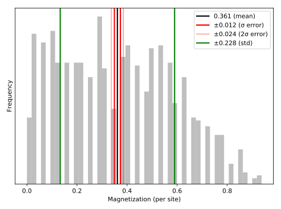

# Manual

## Installation / Updating

To install the package execute the following command in the REPL:
```julia
Pkg.clone("https://github.com/crstnbr/MonteCarlo.jl")
```

To obtain the latest version of the package just do `Pkg.update()` or specifically `Pkg.update("MonteCarlo")`.

## Example

This is a simple demontration of how to perform a classical Monte Carlo simulation of the 2D Ising model:

```julia
# load packages
using MonteCarlo, MonteCarloObservable

# load your model
m = IsingModel(dims=2, L=8, β=0.35);

# choose a Monte Carlo flavor and run the simulation
mc = MC(m);
run!(mc, sweeps=1000, thermalization=1000, verbose=false);

# analyze results
observables(mc) # what observables do exist for that simulation?
m = mc.obs["m"] # magnetization
mean(m)
std(m) # one-sigma error

# create standard plots
hist(m)
plot(m)
```


