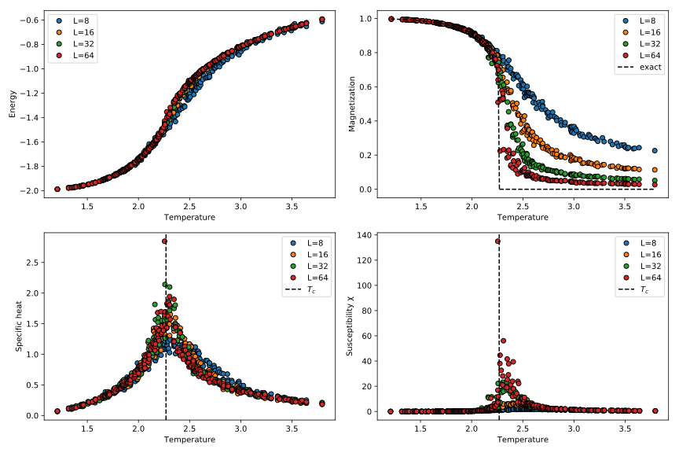

# Showcase

## 2D Ising model

**Results:**


**Code:**
```julia
using MonteCarlo, Distributions, PyPlot, DataFrames, JLD

Tdist = Normal(MonteCarlo.IsingTc, .64)
n_Ts = 2^8 # 2^8
Ts = sort!(rand(Tdist, n_Ts))
Ts = Ts[Ts.>=1.2]
Ts = Ts[Ts.<=3.8]
therm = 10^4 # 10^4
sweeps = 10^3 # 10^3

df = DataFrame(L=Int[], T=Float64[], M=Float64[], χ=Float64[], E=Float64[], C_V=Float64[])

for L in 2 .^ [3, 4, 5, 6]
	println("L = ", L)
	for (i, T) in enumerate(Ts)
		println("\t T = ", T)
		beta = 1/T
		model = IsingModel(dims=2, L=L)
		mc = MC(model, beta=beta)
		# mc.p.global_moves = true # enable Wolff cluster
		# mc.p.global_rate = 1
		run!(mc, sweeps=sweeps, thermalization=therm, verbose=false)
		meas = MonteCarlo.measurements(mc)[:ME]
		push!(df, [L, T, mean(meas[:Magn].m), mean(meas[:Magn].chi), mean(meas[:Energy].e), mean(meas[:Energy].C)])
	end
	flush(stdout)
end

sort!(df, [:L, :T])
@save "ising2d.jld" df

# plot results together
fig, ax = subplots(2,2, figsize=(12,8))

for g in grps
	L = g[:L][1]
	ax[1].plot(g[:T], g[:E], "o", markeredgecolor="black", label="L=$L")
	ax[2].plot(g[:T], g[:C_V], "o", markeredgecolor="black", label="L=$L")
	ax[3].plot(g[:T], g[:M], "o", markeredgecolor="black", label="L=$L")
	ax[4].plot(g[:T], g[:χ], "o", markeredgecolor="black", label="L=$L")
end
ax[1].legend(loc="best")
ax[1].set_ylabel("Energy")
ax[1].set_xlabel("Temperature")

ax[2].set_ylabel("Specific heat")
ax[2].set_xlabel("Temperature")
ax[2].axvline(x=MonteCarlo.IsingTc, color="black", linestyle="dashed", label="\$ T_c \$")
ax[2].legend(loc="best")

ax[3].set_ylabel("Magnetization")
ax[3].set_xlabel("Temperature")
x = range(1.2, stop=MonteCarlo.IsingTc, length=100)
y = (1 .- sinh.(2.0 ./ (x)).^(-4)).^(1/8)
ax[3].plot(x,y, "k--", label="exact")
ax[3].plot(range(MonteCarlo.IsingTc, stop=3.8, length=100), zeros(100), "k--")
ax[3].legend(loc="best")

ax[4].set_ylabel("Susceptibility χ")
ax[4].set_xlabel("Temperature")
ax[4].axvline(x=MonteCarlo.IsingTc, color="black", linestyle="dashed", label="\$ T_c \$")
ax[4].legend(loc="best")
tight_layout()
savefig("ising2d.pdf")
savefig("ising2d.svg")
```
